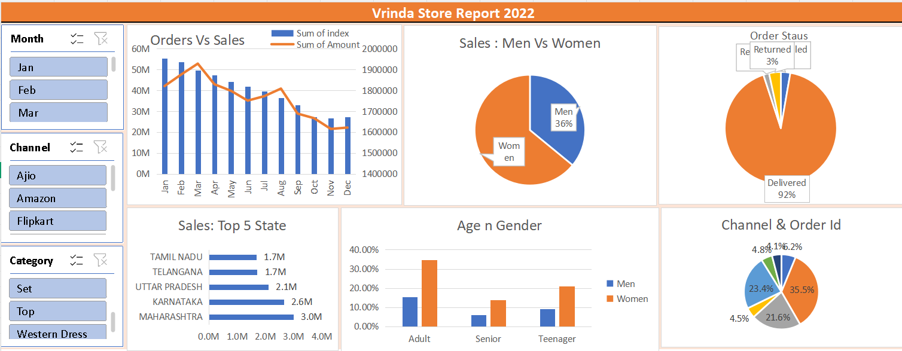

# Retail-Sales-Dashboard-Excel
Excel-based retail sales dashboard providing insights into sales trends, customer behavior, order status, and channel performance.

# Vrinda Store Data Analysis Dashboard

## Project Overview

This project analyzes the sales performance of Vrinda Store using Microsoft Excel. The dashboard provides insights into customer demographics, sales trends, order status, state-wise performance, and sales channels.

## Tools Used

* Microsoft Excel
* Pivot Tables
* Pivot Charts
* Slicers
* Dashboard Design

## Dataset

The dataset contains over 30,000 sales records with information such as:

* Order ID
* Customer ID
* Gender
* Age
* Order Status
* Sales Channel
* Product Category
* State
* Revenue

## Dashboard Insights

### Sales vs Orders

Analyzed monthly sales and order trends throughout the year.

### Men vs Women Analysis

Compared revenue contribution by gender.

### Order Status Analysis

Identified the percentage of delivered, cancelled, returned, and refunded orders.

### State-wise Performance

Determined the top-performing states based on sales revenue.

### Age and Gender Analysis

Analyzed purchasing behavior across different age groups and genders.

### Channel Analysis

Compared order distribution across sales channels such as Amazon, Myntra, Ajio, and others.

## Key Findings

* Women contributed a higher percentage of total sales.
* Maharashtra generated the highest revenue among all states.
* Amazon was one of the leading sales channels.
* Adult customers formed the largest customer segment.
* Most orders were successfully delivered.

## Project Outcome

The dashboard helps business stakeholders understand customer behavior, monitor sales performance, and make data-driven decisions.

## Dashboard Preview

## Author

Aanya Nagaria
Data Analytics Project
